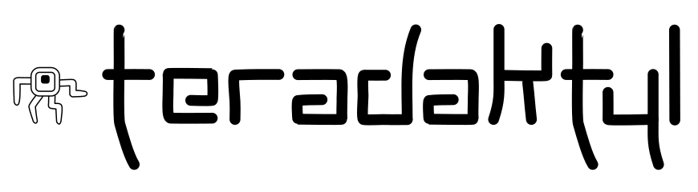

[![NPM version][npm-image]][npm-url]
[![build status][travis-image]][travis-url]

# Typescript Unit Testing Framework

A light, unit testing framework for Typescript, created mostly to assist with the understanding of how unit testing frameworks function. This framework includes both a test runner and assertion library. It is very simple to setup and has no additional dependencies.

Future iterations will include mocking and dependency injection features.

# Getting Started

## Installing
**teradaktyl** can be installed via npm
```bash
npm install --save-dev teradaktyl
```
## Running Tests
#### From the Command-Line

**teradaktyl** can be executed from the command-line and takes 1 parameter; the name of the folder where your tests are stored.
##### Example
###### Where the tests are stored in a folder called 'tests'
```bash
teradaktyl tests
```
#### From your Project

Add a **"test"** script into the scripts sections of your projects **package.json** file.
```bash
"scripts": {
    "test": "teradaktyl tests"
  }
```
Tests can now be executed from a terminal using the following
```bash
npm test
```

## Creating Tests


# Coming in Future Iterations...
#### Dependency Injection
The ability to inject dependencies into classes to facilitate single unit testing.
#### Mocking
The ability to mock dependencies injected into classes.

[npm-image]: https://img.shields.io/npm/v/piczelspydr.svg?style=flat-square
[npm-url]: https://www.npmjs.com/package/piczelspydr
[travis-image]: https://travis-ci.com/piczelspydr/teradaktyl.svg?branch=master&style=flat-square
[travis-url]: https://travis-ci.com/piczelspydr/teradaktyl
